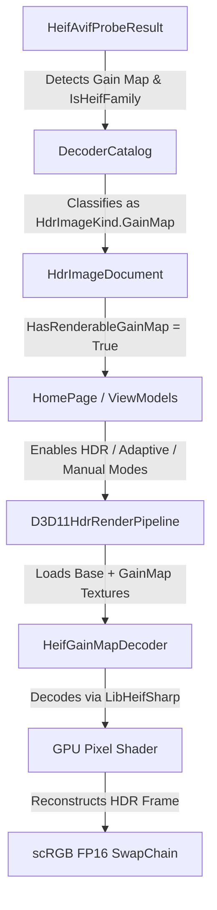

# HEIF/HEIC Gain-Map Support

This document details the implementation and design of the HEIF/HEIC Gain-Map rendering, reconstruction, and export pipeline in `HdrImageViewer`.

---

## 1. Background & Motivation
Apple devices (iPhone 15, iPhone 16, etc.) capture HDR photos using a combination of a standard dynamic range (SDR) base image and an auxiliary gain map (contained in a HEIF/HEIC container). When rendered on an SDR display, only the base SDR image is shown. When rendered on an HDR-capable display, the auxiliary gain map is decoded and used to reconstruct the original high dynamic range scene.

In this codebase, we added native support for decoding, parsing, rendering, and exporting these HEIF/HEIC Gain-Map files, supporting both Apple's proprietary metadata format and standard Adobe/ISO 21496-1 metadata.

---

## 2. Metadata Standards Supported

### Apple Proprietary `HDRGainMap 1.0`
Apple uses the XMP namespace `http://ns.apple.com/HDRGainMap/1.0/`.
- **Primary metadata attribute**: `HDRGainMapHeadroom` represents the ratio of HDR peak brightness to SDR white level (e.g., 8.0, representing 3.0 stops of HDR headroom).
- **Fallback**: If no XMP headroom metadata is present but the gain-map auxiliary track is detected, a fallback headroom of 8.0 (3.0 stops) is assumed.

### Adobe / ISO 21496-1 Standard
Adobe and ISO use standard metadata namespaces (`http://ns.adobe.com/hdr-gain-map/1.0/` and `http://ns.iso.org/iso21496-1/1.0/`):
- **Parameters parsed**:
  - `GainMapMin`: Minimum gain map value (log base 2).
  - `GainMapMax`: Maximum gain map value (log base 2).
  - `Gamma`: Gamma correction applied to the gain map.
  - `OffsetSDR` / `OffsetHDR`: Black offset to prevent zero-division in SDR and HDR domains.
  - `HDRCapacityMin` / `HDRCapacityMax`: Minimum/Maximum display headroom required to apply the gain map.
  - `BaseRenditionIsHDR`: Boolean flag indicating whether the base image is the HDR rendition instead of the SDR rendition.

---

## 3. Architecture & Code Map

### Key Components

1. **[HeifGainMapDecoder.cs](file:///c:/Users/38933/Desktop/viewer/Services/HeifGainMapDecoder.cs)** (NEW):
   - Integrates with `LibHeifSharp` to open the container, locate the auxiliary gain map image handle (by matching `urn:com:apple:photo:2020:aux:hdrgainmap`), and decode both the base SDR and the auxiliary gain map.
   - Extracts and parses XMP metadata to generate `GainMapShaderConstants`.
   - Maps base image color gamut (Display P3, BT.2020, BT.709) to shader parameters.
   - Handles pixel bit depth expansion (10/12-bit to 16-bit) on the gain map.

2. **[DecoderCatalog.cs](file:///c:/Users/38933/Desktop/viewer/Services/DecoderCatalog.cs)** (MODIFIED):
   - Correctly classifies files containing HEIF auxiliary gain maps as `HdrImageKind.GainMap` (previously mapped to `SingleLayerHdr`, which broke mode switching).
   - Reports the correct transfer function description (`SDR 底图 + gain map 重建`).

3. **[HeifAvifProbeResult.cs](file:///c:/Users/38933/Desktop/viewer/Models/HeifAvifProbeResult.cs)** (MODIFIED):
   - Properly identifies Display P3 ICC color profiles in Apple HEIF images instead of displaying "未知" (unknown) color metadata.
   - Refines display descriptions in the inspector panel.

4. **[HdrImageDocument.cs](file:///c:/Users/38933/Desktop/viewer/Models/HdrImageDocument.cs)** (MODIFIED):
   - Exposes `HasRenderableGainMap` which unifies Ultra HDR (JPEG) and HEIF gain maps under a single boolean indicator.

5. **[HomePage.xaml.cs](file:///c:/Users/38933/Desktop/viewer/Pages/HomePage.xaml.cs)** (MODIFIED):
   - Uses `HasRenderableGainMap` to allow UI HDR mode toggling (SDR, HDR, Adaptive, Manual) for HEIF files.
   - Ensures the fallback viewer doesn't accidentally trigger for renderable gain maps.

6. **[D3D11HdrRenderPipeline.cs](file:///c:/Users/38933/Desktop/viewer/Rendering/D3D11HdrRenderPipeline.cs)** (MODIFIED):
   - Orchestrates the GPU resource allocation and routes HEIF gain maps to the D3D11 textures when loaded.

7. **Export Services** (MODIFIED):
   - **[GainMapHdrExportService.cs](file:///c:/Users/38933/Desktop/viewer/Services/GainMapHdrExportService.cs)**: Integrates decoding of HEIF gain-maps to support converting them to JPEG UltraHDR.
   - **[SingleLayerHdrExportService.cs](file:///c:/Users/38933/Desktop/viewer/Services/SingleLayerHdrExportService.cs)**: Allows baking the HEIF gain-map HDR reconstruction into native JXL/AVIF/HEIC HLG or PQ files.

---

## 4. Mathematical Reconstruction Equations

The D3D11 HLSL pixel shader (`Shaders.hlsl`) performs the reconstruction based on the metadata constants:

### Apple Proprietary Model
For Apple HEIF files, the shader uses `GainMapControl.y > 0.5` as a signal to execute the Apple proprietary path:
$$\text{Weight} = \text{UserHeadroomAdjustment} \times \frac{\log_2(\text{DisplayPeak}) - \log_2(\text{SdrWhite})}{\log_2(\text{GainMapMax})}$$
$$\text{Boost} = \text{pow}(\text{GainMapPixel}, 2.4) \times \text{Weight} \times \log_2(\text{GainMapMax})$$
$$\text{HDRColor} = \text{SDRColor} \times 2^{\text{Boost}}$$

### Adobe/ISO 21496-1 Standard Model
For standard files, the log-space linear blending is used:
$$\text{Weight} = \text{Clamp}\left(\frac{\log_2(\text{DisplayPeak}) - \text{HdrCapacityMin}}{\text{HdrCapacityMax} - \text{HdrCapacityMin}}, 0, 1\right)$$
$$\text{LogGain} = \text{GainMapMin} + \text{GainMapPixel} \times (\text{GainMapMax} - \text{GainMapMin})$$
$$\text{LinearGain} = \text{pow}(2, \text{LogGain} \times \text{Weight})$$
$$\text{HDRColor} = (\text{SDRColor} + \text{OffsetSDR}) \times \text{LinearGain} - \text{OffsetHDR}$$

---

## 5. Verification Checklist

1. **Format Detection**: Opening an Apple HEIC file shows format type `HEIC gain map` and the inspector lists `SDR 底图 + gain map 重建`.
2. **Color Profile**: The color profile is successfully identified as `ICC (Display P3 推断)` for Apple HEIFs.
3. **Display Modes**: Adaptive, HDR, and Manual modes are fully interactive, and the headroom slider adjusts the HDR intensity smoothly on screen.
4. **Console Timing Output**: The console status output reports:
   `libheif (primary) [open Nms, decode Nms, copy Nms] + libheif (gain map) [open Nms, decode Nms, copy Nms]`
